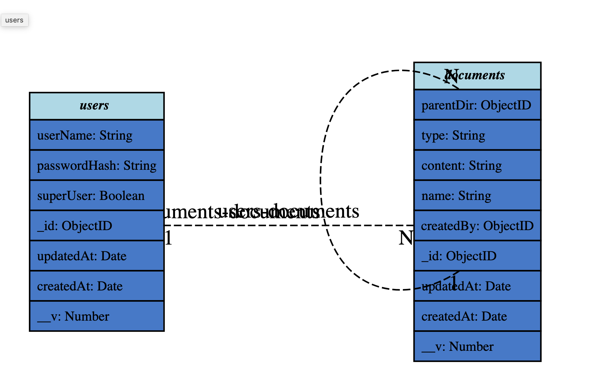

# Document-Management-System

This is a system (API) that manages documents with users.
It is built with NodeJS, Express and MongoDB as it's database.

#### Key Application Features
Created user have 2 types super user and regular user
- Regular Users can:
    - Login
    - Create a file/folder
    - Move File across folders.
    - List files and folders.

- In addition to the regular user functions, a super user can:
    - Create regular users.

**Documents**:
Documents can be created and must have:
- title
- content
- access; set by default to public but can be any of `private, public or role`

**Authentication**:
Users are authenticated and validated using JSON web token (JWT).
Requests to protected routes are validated using the generated token.

## Development
This application was developed using [NodeJs](https://nodejs.org) with express for routing. Postgres was used for persisting data with [Sequelize](https://sequelizejs.org) as [ORM](https://en.wikipedia.org/wiki/Object-relational_mapping).

The frontend was built with the [react](https://facebook.github.io/react/) and [redux](reduxjs.org) framework.

#### Technologies Used

- Node.js
- Express
- MongoDB
- Jest

#### Pre-requisites
1. Node.js v14
2. Docker

## Usage
- Run docker command `docker-compose up`.
- it will start the app listen to port 300 (http://localhost:3000)
- When the application is up the db contain a super user and regular user

|UserName                      | Password|UserType|
| :---            |          :--- |:---|
|superUser1              | 1234|super user|
|azhar1             | 1234|regular user|

## Swagger Endpoint

Swagger spec can be access from http://localhost:3000/api-docs

## API endpoints

|End-Points                       | Functionality|
| :---            |          :--- |
|POST /user/register              | Creates a new user|
|POST /user/authenticate              | Login user|
|POST /document/create              | Create file/folder|
|PATCH /document/move              | Move file|
|GET /document/list              | List files and folders|

# Integration Testing Using Jest
Tests are run by using jest.

The steps to run the integration tests are:

1.  `npm install`
2.  `npm run test`

Currently the test coverage is set to 80% and the report can see in `tests/coverage`

# Data Model

